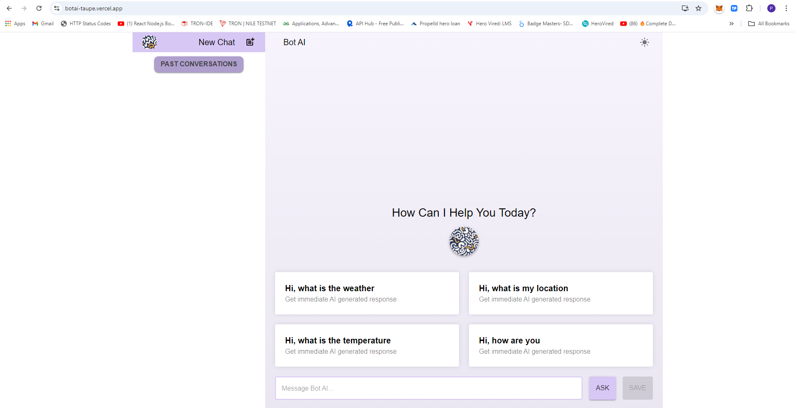
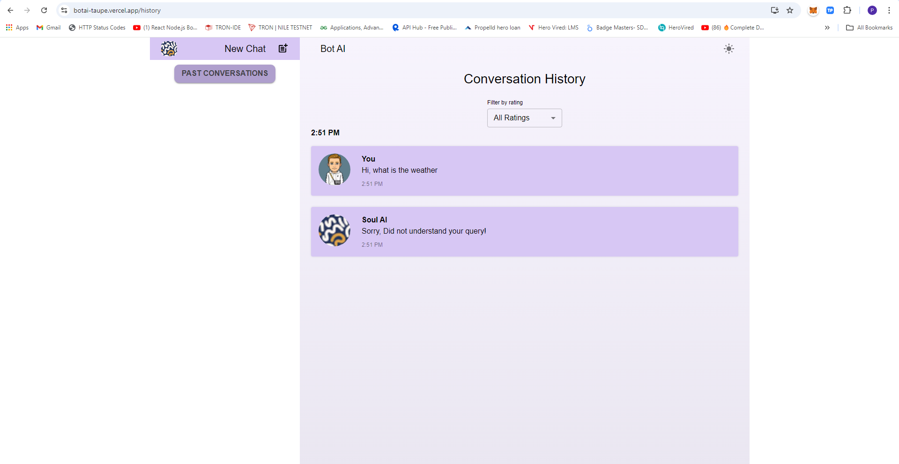

# React With Material UI BOT AI Application

This repository contains a simple AI chatbot interface built using **React** and **Material UI**, designed to allow users to interact with a bot, provide feedback, and revisit conversations. The project focuses on providing an intuitive, responsive, and feature-rich user experience with easy navigation and filtering capabilities for managing chat histories and feedback.

## Demo

Check out the live demo: [Bot AI Application](https://botai-taupe.vercel.app/)

## Table of Contents

- [Features](#features)
- [Project Structure](#project-structure)
- [Tech Stack](#tech-stack)
- [Installation](#installation)
- [Usage](#usage)
- [Deployment](#deployment)
- [Screenshots](#screenshots)
- [Contributing](#contributing)
- [License](#license)

## Features

1. **Interactive Chat Interface**: Users can interact with a mock AI chatbot, and the bot's responses are fetched from a JSON file (`sampleData.json`).
2. **Thumbs Up/Down Feedback**: Users can like or dislike the bot's responses by hovering over a message and using the floating thumbs up/down buttons.
3. **End-of-Conversation Feedback**: Users can provide a rating (out of 5) and give subjective feedback at the end of each conversation.
4. **Conversation History**: Conversations are automatically saved and can be revisited through a sidebar or top navigation panel. Each saved conversation includes the user's feedback.
5. **Feedback Review**: Users can view a summary of feedback across multiple conversations and filter them based on rating. The feedback is presented in a well-organized, sortable table.
6. **Multiple Conversations**: The app supports multiple chat sessions, allowing users to start new conversations while preserving previous ones.
7. **Responsive Design**: The application is built with a focus on UI/UX using Material UI, ensuring responsiveness across different device sizes.


## Project Structure

```bash
.
├───api
│   └───sampleData.json         # Mock responses for the chatbot
├───assets                      # Static assets like logos, images
│   ├───bulb.png
│   ├───center-logo.png
│   ├───logo.png
│   └───user.png
├───components                  # Reusable UI components
│   ├───Card                    # Card component for displaying chat messages
│   ├───Chat                    # Main chat UI
│   ├───Conversation            # Component to display conversation history
│   ├───FeedbackModal           # Modal for submitting feedback
│   ├───Header                  # Header component
│   ├───InitialChat             # Initial chat interaction components
│   │   ├───Card
│   │   └───InitialChat
│   └───SideNav                 # Sidebar navigation for switching between pages
├───pages                       # Pages corresponding to views in the app
│   ├───History                 # History of past conversations
│   └───Home                    # Home page with the main chat
├───theme                       # Theme setup for Material UI
│   ├───ThemeContext.jsx        # Context for managing light/dark theme
│   └───ThemePallete.jsx        # Custom Material UI palette setup
├───utils                       # Utility functions
│   └───index.js
├───App.js                      # Main application component
├───index.css                   # Global styles
└───index.js                    # Entry point of the React app

```

## Tech Stack

- **React:** Frontend framework for building user interfaces.
- **Material UI:** Component library for UI design and styling.
- **JavaScript (ES6+):** Language used for scripting.
- **JSON:** Used to mock AI responses.
- **CSS:** For custom styling.

## Installation
To set up the project locally, follow these steps:

1. Clone the repository:

```bash

git clone https://github.com/surendergupta/botai.git
cd botai

```
2. Install dependencies:

Make sure you have Node.js installed. Then run:
```bash

npm install

```
3. Run the application:

Start the development server:
```bash

npm start

```

The app should now be running on http://localhost:3000.

## Usage

1. **Starting a Conversation:** Begin interacting with the chatbot on the home page.
2. **Providing Feedback:** Use the thumbs up/down buttons during the conversation or provide a detailed rating at the end of the chat.
3. **Reviewing Conversations:** Use the sidebar or top navigation to access past conversations and their associated feedback.
4. **Filtering Feedback:** View all feedback in a sortable table and filter based on ratings.

## Deployment
The app is deployed using Vercel. To deploy your own instance:

1. Ensure you have the Vercel CLI installed:

```bash

npm install -g vercel

```

2. Deploy the app to Vercel:

```bash

vercel

```

Follow the prompts to complete your deployment. Your application will be live at your provided Vercel domain.

## Screenshots

### Home Page



### Conversation History



## Contributing

Contributions are welcome! If you'd like to contribute, please follow these steps:

1. Fork the repository.
2. Create a new branch (```git checkout -b feature-name ```).
3. Make your changes.
4. Commit your changes (``` git commit -m 'Add feature' ```).
5. Push to the branch (``` git push origin feature-name ```).
6. Open a pull request.


## License

This project is licensed under the MIT License - see the LICENSE file for details.

## **Author**

Made with ❤️ by [Surender Gupta](mailto:gupta.surender.1990@gmail.com)

Feel free to reach out via email for any questions or suggestions!